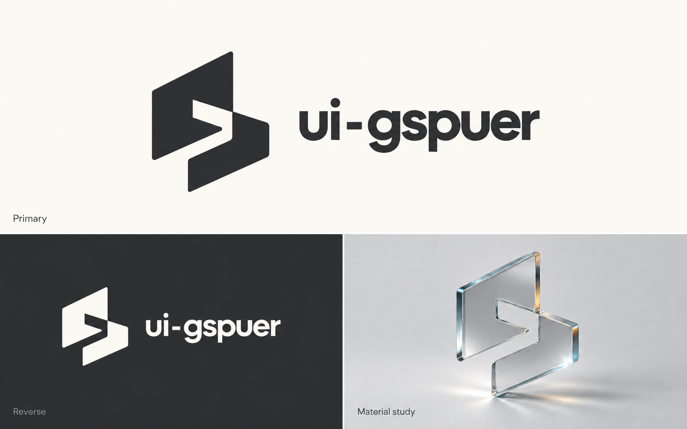
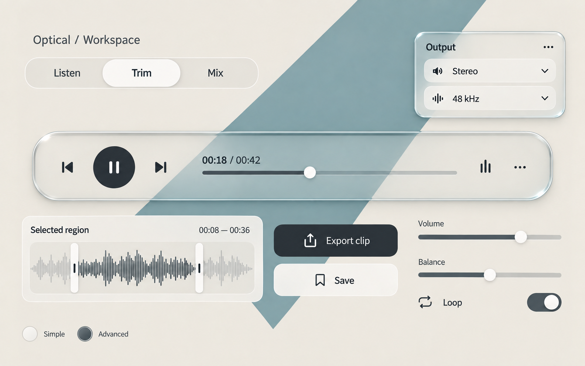
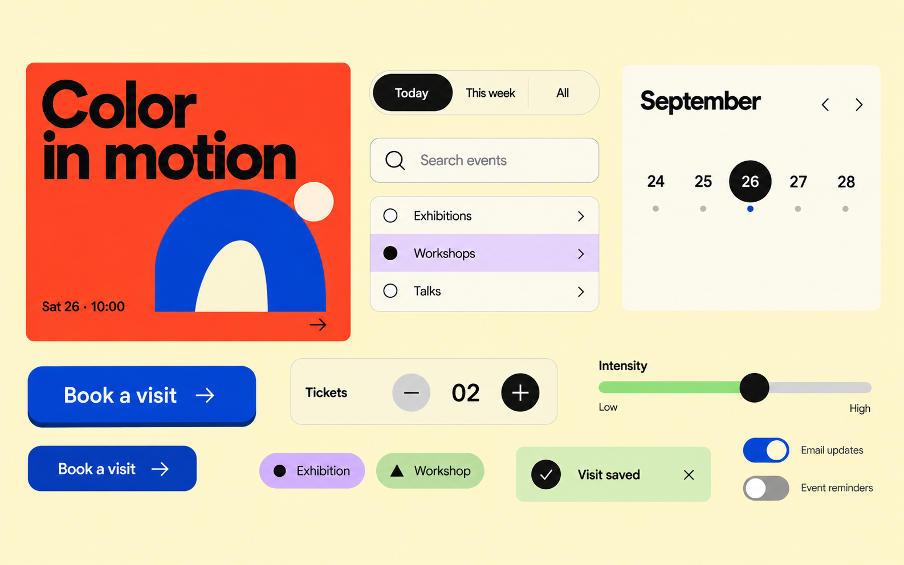
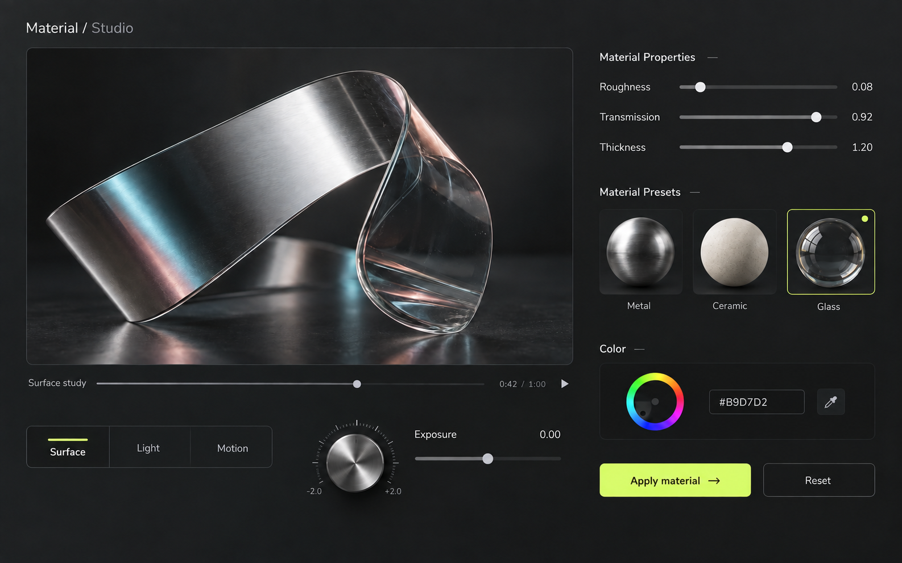
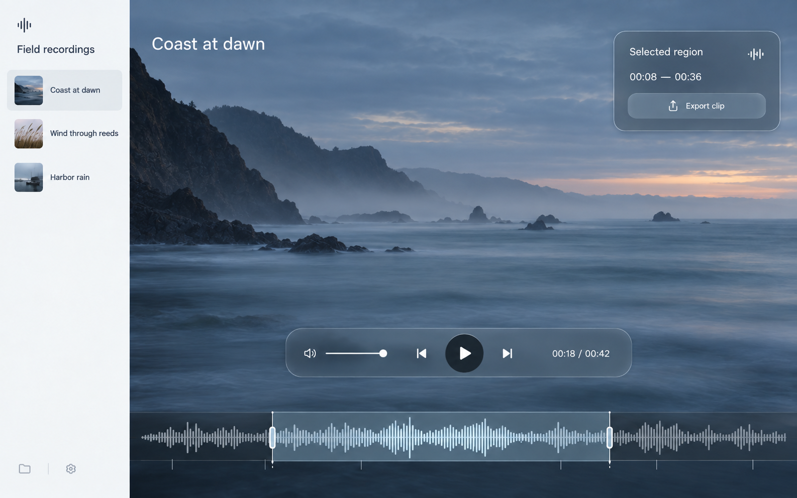
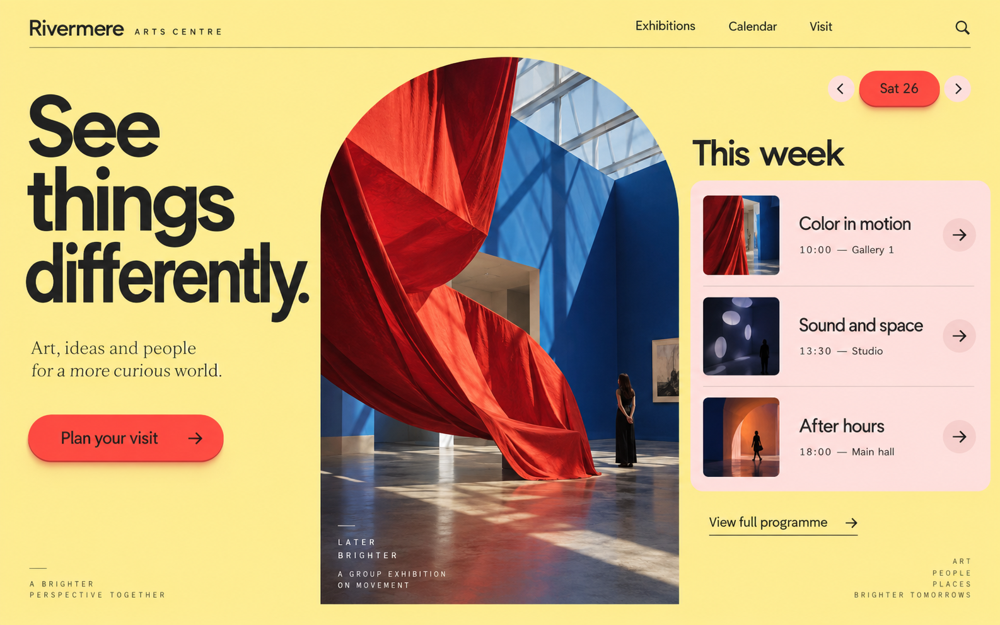
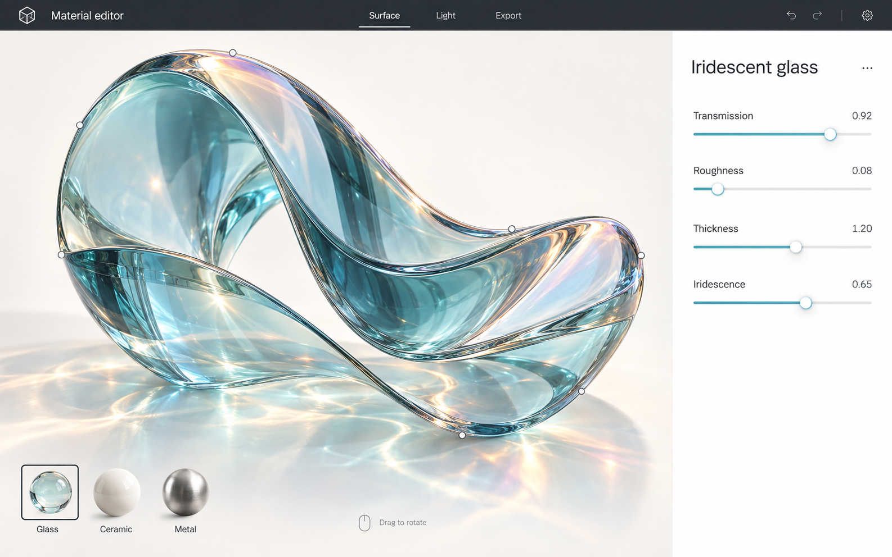

# ui-gspuer

An agent skill for product-specific Web UI design. It connects visual research, implementation decisions, and acceptance criteria through six complementary methods:

**Liquid Glass · Tactile UI · Material 3 Expressive · Shader UI · Spatial UI · Hypermaterial**

Select the methods that support the product, assign each a clear role, and combine them within a consistent visual system. Kinetic Typography, Game-like UI, and Generative UI provide optional extensions.

**Public beta** · [Installation](#install-in-codex) · [Component studies](#component-studies) · [Visual concepts](#visual-concepts) · [Agent instructions](SKILL.md) · [Validation status](references/research-coverage.md#validation-status)



*Identity exploration: a shared silhouette across flat and optical treatments.*

## Design approach

1. **Research the product and theme.** Study comparable workflows and relevant original websites, including editorial, fashion, portfolio, and experimental work where appropriate.
2. **Define the combination.** Assign selected methods to specific regions and states, with shared rules for typography, color, lighting, and motion.
3. **Specify and implement.** Translate references into concrete layout, material, and interaction decisions. Choose DOM/CSS, SVG, imagery, Canvas, shaders, or 3D according to the experience required.
4. **Verify the result.** Evaluate visual direction and functional behavior separately, including responsive layouts, keyboard interaction, and applicable fallbacks.

The workflow preserves the product's content, brand, functionality, and stack. Local changes stay local. Anti-template guidance addresses observable design problems rather than prohibiting particular colors, materials, or components. 3D modeling is used when explicitly requested or necessary for the core experience.

## Component studies

Three coordinated component families explore how selected methods can share typography, geometry, lighting, and state cues. Each board brings several components together within one visual system.

### Optical workspace

**Liquid Glass + Spatial.** Thin transmitted surfaces separate transport controls, selection tools, and temporary settings. Quiet backgrounds and opaque actions preserve legibility.



### Expressive programme

**Expressive + Tactile.** Contrasting shapes, deliberate color roles, and press-depth cues connect event selection, date controls, ticket quantity, and booking actions.



### Material studio

**Hypermaterial + Tactile, within a proposed Shader workflow.** A rich optical preview sits beside restrained parameter controls. Metal, ceramic, and glass retain distinct appearances.



## Visual concepts

The following concepts apply selected combinations to three product tasks. All showcase artwork, including the identity and component boards above, is AI-generated. Interaction, rendering behavior, and accessibility require validation in an implemented interface.

### Field recording workspace

**Spatial + Liquid Glass, with tactile control cues.** A recording canvas, layered transport controls, and a focused audio selection.



### Expressive exhibition programme

**Expressive + Tactile.** Typographic scale, shaped imagery, and a prominent primary action support exhibition discovery and visit planning.



### Digital material editor

**Hypermaterial, with a proposed Shader workflow.** A material preview and parameter inspector connect optical appearance to an authoring task.



[Image specifications, sources, and original prompts](docs/showcase/prompts.md). Showcase images are documentation examples, not templates that agents must reproduce.

## Install in Codex

Requirements: Git and a Codex environment with local skill discovery.

Clone into a new skill directory:

```sh
mkdir -p "${CODEX_HOME:-$HOME/.codex}/skills"
git clone https://github.com/Laocaiyj/ui-gspuer.git "${CODEX_HOME:-$HOME/.codex}/skills/ui-gspuer"
```

For an existing manual installation, back up the directory before replacing it. Start a new agent session if the skill is not discovered immediately.

Invoke the skill with the product goal and constraints:

```text
Use $ui-gspuer to redesign this audio editor. Preserve its recording data,
editing actions, brand, and stack. Research relevant products and visual
references, select suitable methods, then implement and verify the result.
```

For a focused change, specify the boundary:

```text
Use $ui-gspuer to improve only this button's press and cancellation feedback.
Preserve the existing layout and visual direction.
```

## Agent compatibility

The skill uses English Markdown instructions and linked references. Follow the user's language and localization requirements for generated interfaces and responses.

For another host with skill-folder support, use its documented discovery location. Otherwise, provide [SKILL.md](SKILL.md) and the references it selects as context. `agents/openai.yaml` supplies Codex-specific display metadata. The design methods do not require a particular frontend framework or rendering library.

Implementation requires project-file access; current design research requires browsing; rendered and interactive validation requires a browser or equivalent runtime tooling. Report checks that the host cannot perform as unverified. Compatibility and outcome quality must be evaluated in each target environment.

## Documentation

| Document | Purpose |
| --- | --- |
| [SKILL.md](SKILL.md) | Agent entry point, task routing, workflow, and completion criteria |
| [Design research](references/design-research.md) | Source selection, observation, and transfer to the current product |
| [Art direction and concept images](references/art-direction.md) | Visual ideas, composition, image-generation briefs, and artistic review |
| [Method selection](references/design-directions.md) | Roles of the six core methods, combinations, and links to nine implementation recipes |
| [Implementation specification](references/implementation-spec.md) | Concrete layout, material, state, and implementation decisions |
| [Direction acceptance](references/direction-acceptance.md) | Observable criteria for selected methods and their combined behavior |
| [Visual review](references/visual-quality.md) | Product-specific quality checks and anti-template guidance |
| [Evaluation and iteration](references/evaluation-loop.md) | Discrepancy diagnosis, correction, and controlled model comparison |
| [Case index](references/studied-cases.md) | Primary sources and the depth of each recorded observation |
| [Research coverage](references/research-coverage.md) | Method coverage, validation status, and maintenance requirements |

## Validation and attribution

The public beta includes documented methods, source research, and limited historical component observations. End-to-end generation across product types and comparative model success rates remain unevaluated. The [validation record](references/research-coverage.md#validation-status) distinguishes these evidence levels.

Technical references include primary material from Apple, Google, MDN, W3C, Motion, Three.js, GSAP, Vercel, and individual authors. [External skill references](references/visual-quality.md#primary-references-and-adoption-boundaries) identify the guidance adopted for visual review. This project is an independent synthesis; framework conformance and platform capabilities must be checked against the target implementation and dependency versions.

## License

[MIT](LICENSE) covers this repository's original content. Referenced third-party code, images, fonts, and trademarks remain subject to their respective licenses and terms.
