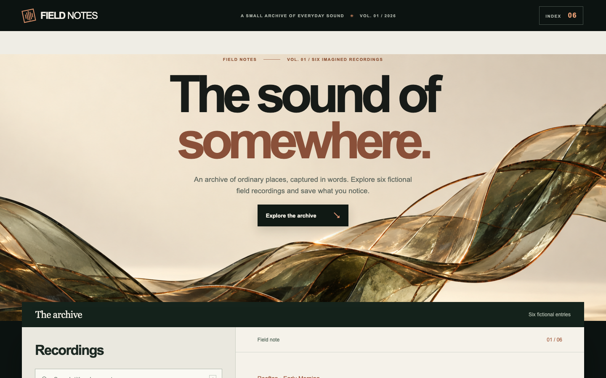
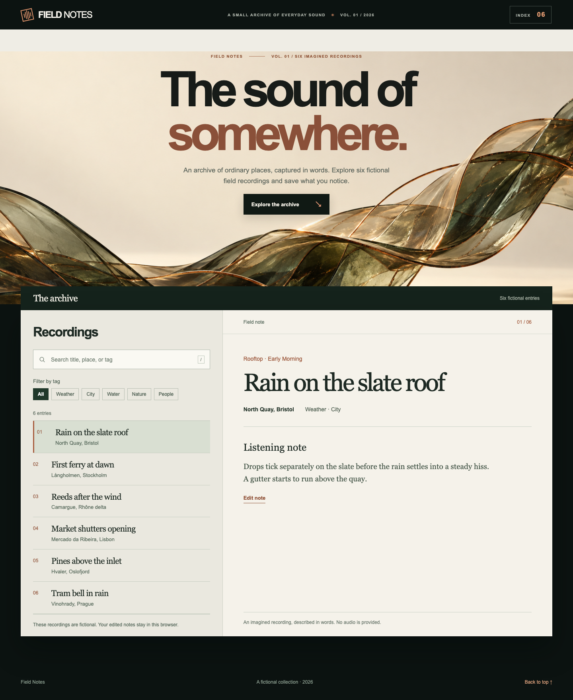
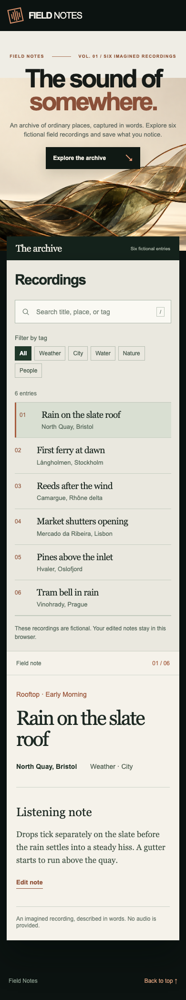

# Field Notes: a browser-based field-recording catalog

**One implemented case for ui-gspuer.** Field Notes is an English catalog of six fictional recordings. Visitors can search titles and places, filter by atmosphere, select a record, and edit its listening note. Notes are saved in that browser's local storage and remain after refresh. There is no account, network service, or audio playback.

## Task and skill use

The fixed English brief included this exact task excerpt:

> Build an English browser-based catalog for six fictional field recordings. Users can search, filter by tag, select a record, edit its written note, save it, and find the saved note after refresh.

It also required no account, product network service, or audio playback, plus desktop, mobile, keyboard, and reduced-motion checks. These constraints set the review boundary before implementation. The run used `SKILL.md` at commit `6f871ef6d23d778d6b2ae409fbacc0b82910de81` to connect source observation, visual direction, implementation, and rendered review.

[Freesound](https://freesound.org/) informed the visible search and recording metadata; [radio aporee](https://aporee.org/mobile/) informed the link between a recording and its place. The resulting design uses oversized typography, a sculptural copper-and-pine hero, and a quiet paper-toned list-detail workspace. The sculpture is AI-generated decorative media, not evidence of a real recording or playback. The six recording entries and descriptions are fictional; real place names provide context. No source media was copied.

The initial direction kept playback affordances out of a text-only experience. Save and Cancel are explicit, and an unsaved draft is protected when changing records. After visual feedback, two layouts were rendered at desktop and mobile sizes: an immersive rainy-place cover and a type-led sculptural cover. The latter was chosen because its main visual carries the eye into the working archive while keeping mobile search visible. A later review simplified the archive: it removed invented duration and time metadata, decorative prompts, and a generated location image from the detail view. This is one guided case with visual revisions, not a comparison across agents or models.

## What was checked

Four state tests passed for combined search/filter behavior, saved notes across a new session, cancellation and dirty-draft protection, and storage failure. Browser interaction checks passed for searching, filtering, selection, Save followed by refresh, Cancel, the `/` search shortcut, edit focus and Escape, a 390 px mobile viewport, and reduced-motion preference. The browser made no external requests and reported no page errors in that run.

These are screenshots of the **running browser interface**. The component boards and visual concepts elsewhere in this repository are **AI-generated static concept images**. The local preview source and raw test records are not part of the published skill. This case does not establish repeatable output quality, full accessibility conformance, cross-browser support, or production readiness.
